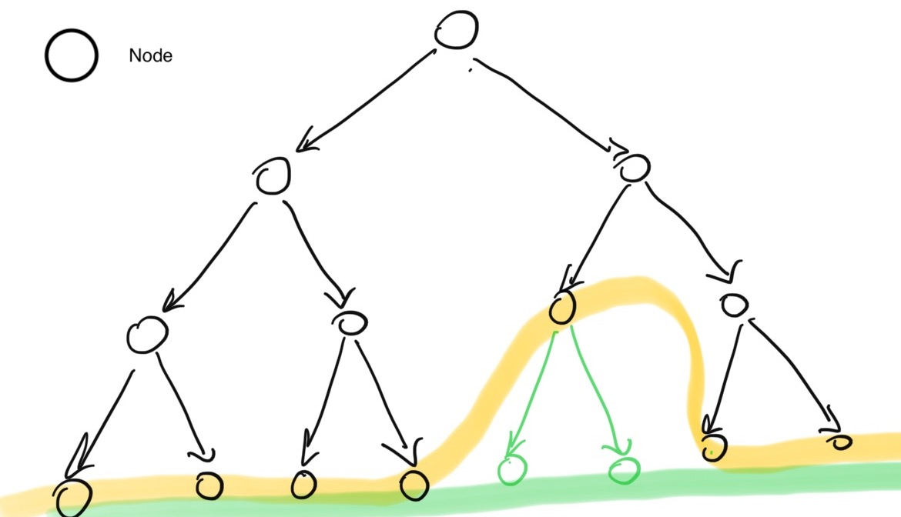
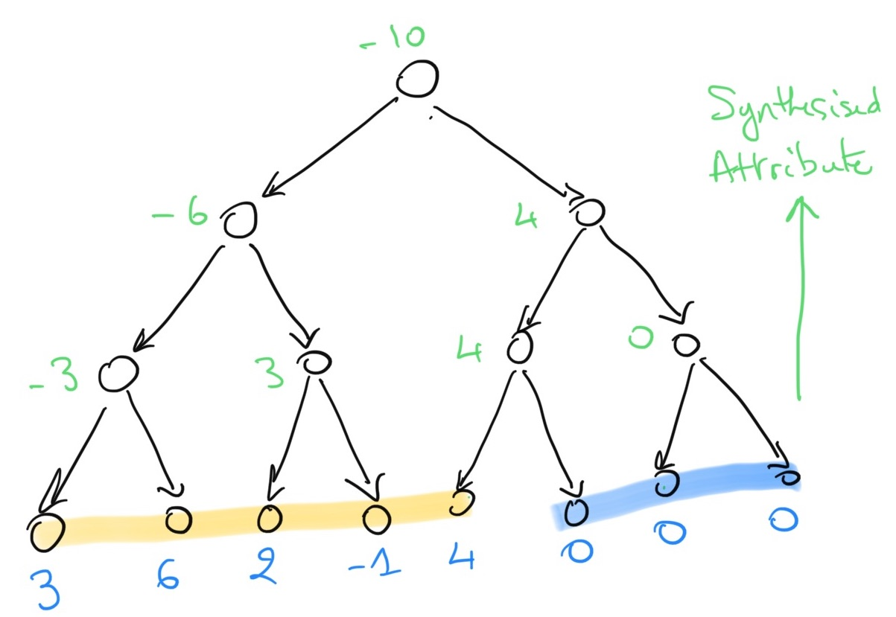
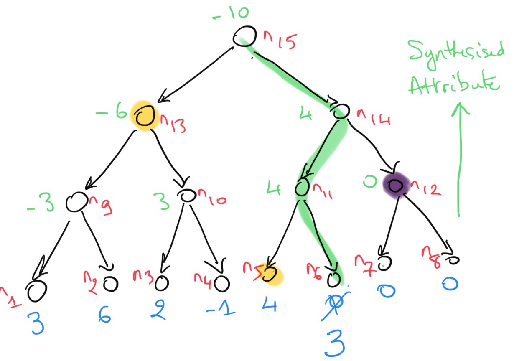
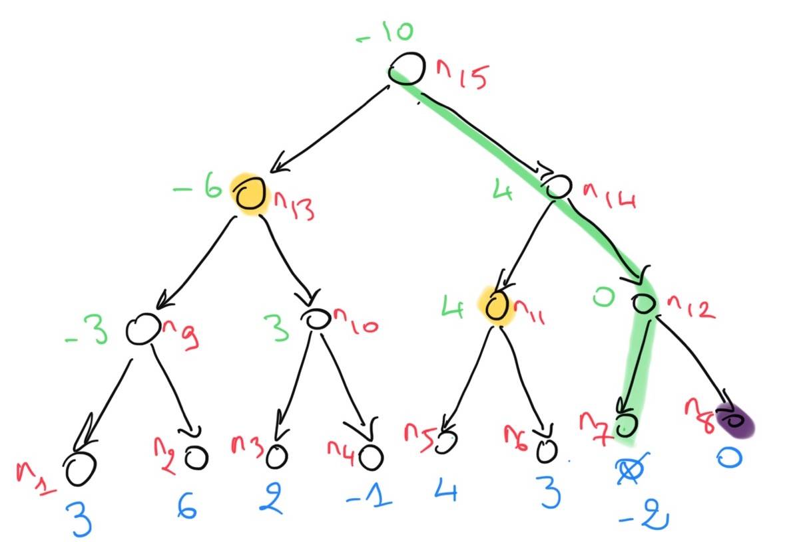

# Verification of the Deposit Smart Contract in Dafny

Deposit smart contract in Dafny

# Background

The core component of the Deposit Smart Contract is the so-called _Incremental Merkle Tree_ algorithm.

A _Merkle tree_ is a (_binary_ and _complete_) tree decorated with some _attribute_ (information attached to the nodes).
Computing the attribute for all the nodes of a tree usually requires to walk the tree and to explore all the nodes, for instance using a Depth First Traversal algorithm.

In the context of a Blockchain, a Merkle tree may be used to store elements of a list `L`. The value of the attribute (the _hash_) on the tree root can be used to test membership of an element in the list. The is known as a _Merkle Proof_.

> In this project we are not concerned with Merkle Proofs but rather in computing an attribute (e.g. _hash_) on the root of a tree that stores a list `L`.

## Merkle Trees

> A tree is:

> 1. a **binary** tree if every node that is not a leaf has two children and,
> 2. a **complete** tree if all the branches of the tree from the root to the leaves have the same > height `h`.

<center></center>

The tree composed of the black nodes above is a binary tree but is not complete.
Adding the green nodes make it complete.
The (complete) tree height is `4` and is has `15` nodes and `8` leaves.

> A **Merkle tree** is a _binary_ and _complete_ tree decorated with the Merkle (_hash_) attribute.

The leaves of a Merkle tree contains the elements of a list `L` from left to right when traversed _in-order_ (left, node, right).
Again, the elements of `L` are organised as a binary tree in order to define (and compute) a property of `L`, the _hash_ of `L`, as an attribute on the tree representation of `L`.

## Properties of Merkle Trees

As a Merkle tree of height `h` is a binary complete tree, it satisfies some properties like:

1. the number of nodes in the tree is `2^(h) - 1` and,
2. the number of leaves in the tree is `2^(h - 1)`.

> It follows that Merkle trees of height `h` can represent lists of at most `2^(h - 1)` elements.

## Tree Representation of a List

To represent a list of `n < 2^(h - 1)` elements with a binary complete tree of height `h`,
 `L` is **right-padded** with dummy or neutral elements (e.g. zeroes) to obtain `L'` of length `2^(h - 1)`. `L'` is used to define the leaves of a complete binary tree, on which the Merkle attribute (_hash_) is computed.

<center>

</center>

In the tree above, the list `[3, 6, 2, -1, 4]` is stored in the 5 leftmost leaves, and three zeroes (default values) are used to fill in the remaining leaves.

## Incremental Computation of Merkle Trees

The incremental Merkle tree problem is informally stated as:

> Can we _incrementally_ (and efficiently) compute the Merkle attribute on binary complete trees that represent lists that _grow monotonically_ such as `L`, `L + e1`, `(L + e_1) + e_2` (where _+_ is the `append` operator on lists) and so on?

More precisely, the problem of interest can be stated as follows:

> **IncMerkleTree** Problem:
**given** 1) a Merkle tree of height `h`, `MKL(L)`, that stores a list `L` that has less than `2^(h -1)` elements, and 2) an element `e`, can we **efficiently compute** (without traversing the `2^h - 1` nodes of the tree) `MKL(L + e)`?

To solve the **IncMerkleTree** problem, it may be useful to recall some simple definitions and algorithms to identify similarities with known problems and also the key issues that we have to address to solve **IncMerkleTree**. In this context, computing attributes on trees seems to be relevant and this is the topic of the next section.

# Computing Attributes on Tree Structures

## Binary Trees

> A _binary tree_ can be defined by an Abstract Data Type (ADT) as follows:

```haskell
datatype Tree =
            Leaf
        |   Node(left: Tree, right: Tree)
```

A node is either a _leaf_ or an _internal node_ with two (ordered) children, _left_ and _right_.
This ADT is enough to represent binary trees, as a binary tree is fully determined by its _root_ which is a node (including trees with single node-leaf).

> This definition does not allow empty trees.

## Synthesised Attributes

The Merkle attribute belongs to the category of _synthesised_ attributes.

> A _synthesised attribute_ on a tree is defined **bottom-up**: the values of the decorations are given on the leaves, and to compute the values on the internal nodes, the values of the left and right children are combined.

A simple example of a _synthesised attribute_ is the _height_ of a tree that can be defined by:

```haskell
function height(root : Tree) : nat
  {
    match root
        //  A leaf has height 1
        case Leaf => 1

        //  The height of node is 1 + the max height of the children
        case Node(lc, rc) => 1 + max(height(lc), height(rc))
  }
```

## Computing Synthesised Attributes
To define trees decorated with an attribute of type `T`, we can use a _generic_ version of the ADT for binary tree
that holds the value `v : T` of the attribute:

```haskell
datatype Tree<T> =
            Leaf(v: T)
        |   Node(v: T, left: Tree, right: Tree)
```

For instance, `Tree<nat>` can store the value of non-negative integers' attributes like `height`.

The height attribute is a simple one. To define a problem that is equivalent to the **IncMerkleTree** problem, we may use a synthesised attribute that is _asymmetric_.
A simple version is to assume that each leave holds an _integer_ value, and the value of an internal node is the difference between the values of the left and right children.
We let `diff(x,y) == x - y`.

To check that the nodes of a `int`-decorated tree stores the value of the previous `diff` attribute, we can use the following predicate:

```haskell
predicate isDecoratedWithDiff(root: Tree<int>)
{
    match root
        case Leaf(v) => true

        case Node(v, lc, rc) => v == diff(lc.v, rc.v)
                                && isDecoratedWithDiff(lc)
                                && isDecoratedWithDiff(rc)
}
```

If a node `root` of a tree satisfies `isDecoratedWithDiff(root)` then the values at each node
(`n.v`) correspond to the values of the attribute `diff`.
The values of the `diff` attribute on (the nodes of) a tree of height `4` that stores the list `[3, 6, 2, -1, 4]` are provided below: the blue values correspond to the leaves and the green ones are the synthesised (computed) ones.  Nodes are labelled `nk` starting from the leaves left to right and upwards to the root level.

<center>

</center>

## Incremental Computation of the Diff attribute

Assume we are given a complete tree of fixed height `h`, and the leaves from left to right store
the values of a list of `n` integers <math>i<sub>1</sub>, i<sub>2</sub>, ..., i<sub>n</sub>, 0, 0, 0, ..., 0</math>, 
right-padded with `2^(h - 1) - n` zeroes.

The following function collects the leaves of a tree in a (indexed) sequence from left
to right:

```haskell
function collectLeaves<T>(root : Tree<T>) : seq<Leaf<T>>
{
    match root
        case Leaf(_, _, _) => [ root ]

        case Node(_, lc, rc, _, _) =>  
            collectLeaves(lc) + collectLeaves(rc)
}
```

In the tree example above, `collectLeaves` returns the sequence `s = [n1, n2, n3, n4, n5, n6, n7, n8]`.

To state that a `int`-tree stores the values of a list `l` as the first `|l|` leaves (left to right),
we define the following predicate:

```haskell
predicate treeLeavesForList(l: seq<int>, root: Tree<int>)
    requires |l| <= |collectLeaves(root)|
{
    forall i::
        0 <= i < |l| ==> l[i] == collectLeaves(root)[i].v
        &&
        |l| <= i < |collectLeaves(root)| ==> collectLeaves(root)[i].v == 0
}
```

For a complete (binary) tree this also amounts to matching the `|l|` leftmost leaves to `l`.
The example above illustrates this for the list `[3, 6, 2, -1, 4]`: `s[0].v == n1.v == 3`,
`s[1].v == n2.v == 6` and so on (sequences of length `n` are indexed from `0` to `n - 1`).

Assume we change the value of one leaf in the above tree, say `n6` from `0` (the default value) to `3`.

1. this impacts the values of the `diff` attributes on the (green) path `p = n15, n14, n11, n6`, and
2. the values needed to re-compute (or update) the `diff` attribute on the nodes of this path are on the left (yellow) and on the right (purple) of `p` (recall that the attribute value of a node combines the values of the left and right children).

<center>

</center>

Furthermore, assume

1. we are interested in the **value of the attribute `diff`** on the **root** `n15` only,
2. the list of stored elements in the leaves grows **monotonically**: once a new element is inserted
    its value is never modified.
3. the **right-most leaves** all have the **default value** (in our example zero).

In the example above, it is clear that to compute the new value of `diff` on `n15`, after changing the value of `n6` to `3`, we need only the yellow and purple nodes.
As the nodes on the right of `p` have the default value, they all have a default value for the attributes (it may depend on the level of a node in tree.)

To compute the updated value of `diff` on `n15` after updating `n6`, we only need to store the three values of the yellow and purple nodes.
And for the next position (`n7`) in which we can add a new element, we will need the yellow and purple nodes' values at `n13`, `n11` and `n8` as depicted below.

<center>

</center>

As a result, it may be possible to compute the updated value of the `diff` attribute on the root
`n15` by storing only a **summary** of the previous computations that capture the values of the yellow (left of current path) and purple (right of current path) nodes.
This is a typical example of **dynamic programming**.

## Incremental Algorithm in Dafny

The file `intTree.dfy` contains the scaffolding for the specification, implementation and proof of an incremental algorithm to compute the `diff` attribute on the root of a tree.

In order to finalise the proof we need to:

1. add data structures to store the values of the yellow (and possibly purple) nodes
2. define how these are updated.

This can be done in the `add` method.
