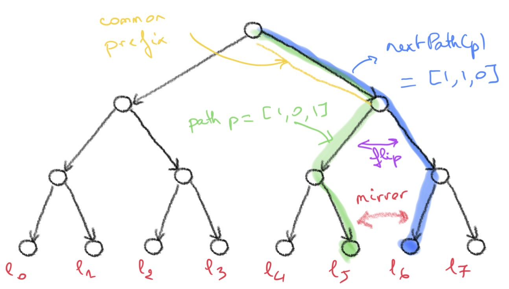

[ [up] ](../README.md) 


# The Deposit Smart Contract Functions

In the previous sections [background](background.md) and [sketch](sketch.md) we have proposed recursive (functional) algorithms to define the `deposit()` and `get_deposit_root()` functions. 

The algorithms use the binary encoding (sequence of bits) of a path `p` in the tree to compute the results.
In this section we explain how to compute the results using only the index of the leaf that is at the end of the path `p`.

## Updating the values of the siblings

Consider the tree in **Figure 1** below and assume that the next available leaf if `l5` (`green` path.)
We have seen in the [sketch](sketch.md) section how to compute the values of the left siblings of the `blue` path, `nextpath(green)` using the bit encoding of `green` with the function `computeLeftSiblingOnNextPathFromLeftRight`:

```dafny
function computeLeftSiblingOnNextPathFromLeftRight(p: seq<bit>, left : seq<int>, right : seq<int>, seed : int) : seq<int>
    requires 1 <= |p| 
    requires |left| == |right| == |p|

    decreases p
{
    if |p| == 1 then
        if first(p) == 0 then [seed] else left 
    else 
        assert(|p| >= 2);
        if last(p) == 0 then 
            init(left) + [seed]
        else 
            assert(last(p) == 1);
            computeLeftSiblingOnNextPathFromLeftRight(init(p), init(left), init(right), diff(last(left), seed)) 
            + [last(left)]
} 
```

We can prove that the index of the leaf at the end of the path `p` is the natural (unsigned int) number 
represented in binary by `p` (little-endian). For instance the `green` path is `[1, 0, 1]` which is
`1 * 2^2 + 0 * 2^1 + 1 * 2^0 = 5`. Let `bitToNat(p)` be the natural number represented by `p`.
Conversely the successive values of `last(p)` in the previous algorithms correspond to the 
modulus of the successive values of `bitToNat(p)`, `bitToNat(p) / 2`, `bitToNat(p) / 4` and so on.
Now assume the height of the tree is `h`.
Given a natural number `k < power2(h)` we let `natToBitList(k , h)` be the binary representation
of `k` on `h` bits (little-endian).

This enables us to rewrite the previous algorithm using the index of the leaf of `p` instead of `p` as follows:

```dafny
function method computeLeftSiblingsOnNextpathWithIndex<T>(
        h : nat, k : nat, left : seq<T>, right : seq<T>, f : (T, T) -> T, seed: T) : seq<T>
        requires |left| == |right| == h
        requires k < power2(h) 

        /** Post-condition that ensures correctness. */
        ensures h >= 1 ==>
            computeLeftSiblingsOnNextpathWithIndex(h, k, left, right, f, seed)
            == 
            computeLeftSiblingOnNextPathFromLeftRight(natToBitList(k, h), left, right, f, seed)

        decreases h 
    {
        if h == 0 then
            []
        else 
            computeWithIndexFromZeroIsCorrect(h, k, left, right, f, seed);
            // Hint for the correctness proof: pre-condition for recursive call is satisfied.
            power2Div2LessThan(k, h);
            assert(k / 2 < power2(h - 1));
            if k % 2 == 0 then
                init(left) + [seed]
            else      
                var r :=  computeLeftSiblingsOnNextpathWithIndex(
                    h - 1, k / 2, init(left), init(right), f, f(last(left), seed));
                r + [last(left)]
    }
```
Dafny can verify that this algorithm is correct given the simple annotation (that is checked by the Dafny verifier) `assert(k / 2 < power2(h - 1))`. The fact that this holds is a consequence of a lemma
`power2Div2LessThan(k, h)` defined [here](https://github.com/PegaSysEng/deposit-sc-dafny/blob/d8b082301e3431776ace38e0a3638b9fd63c392d/src/dafny/smart/helpers/Helpers.dfy#L65).
The previous function is defined [here](https://github.com/PegaSysEng/deposit-sc-dafny/blob/d8b082301e3431776ace38e0a3638b9fd63c392d/src/dafny/smart/algorithms/IndexBasedAlgorithm.dfy#L228).
            
<center>
<figure>

<figcaption><strong>Figure 1</strong>: The next path of a path to <strong>right</strong> leaf. </figcaption>
</figure>
</center>

## Computing the root value

Just as we have hinted before, we can use the index of the leaf at the end of the path `p` to compute the value of the root.

The corresponding version of the algorithm is:

```dafny
function method computeRootLeftRightUpWithIndex<T>(h : nat, k : nat, left : seq<T>, right: seq<T>, f : (T, T) -> T, seed: T) : T
        requires |left| == |right| == h
        requires k < power2(h)

        ensures computeRootLeftRightUpWithIndex(h, k, left, right, f, seed)  == 
            computeRootLeftRightUp(natToBitList2(k, h), left, right, f, seed)

        decreases h 
    {
        if h == 0 then
            seed 
        else 
            // Hint for the correctness proof: pre-condition for recursive call is satisfied.
            power2Div2LessThan(k, h);
            assert(k / 2 < power2(h - 1));
            computeRootLeftRightUpWithIndex(
                h - 1, k / 2, init(left), init(right), f,
                    if k % 2 == 0 then f(seed, last(right)) else f(last(left), seed)
            )
    }
```
and the function is defined [here](https://github.com/PegaSysEng/deposit-sc-dafny/blob/d8b082301e3431776ace38e0a3638b9fd63c392d/src/dafny/smart/algorithms/IndexBasedAlgorithm.dfy#L93). 

[ [up] ](../README.md) 
