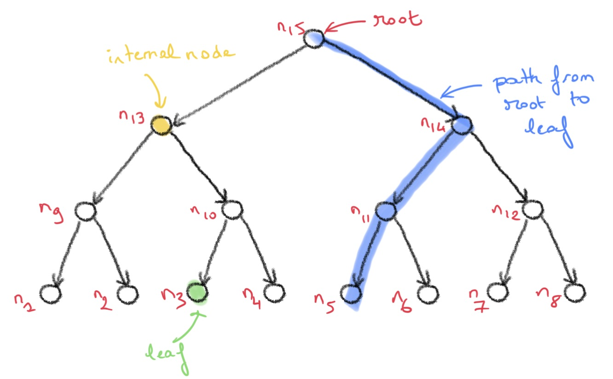
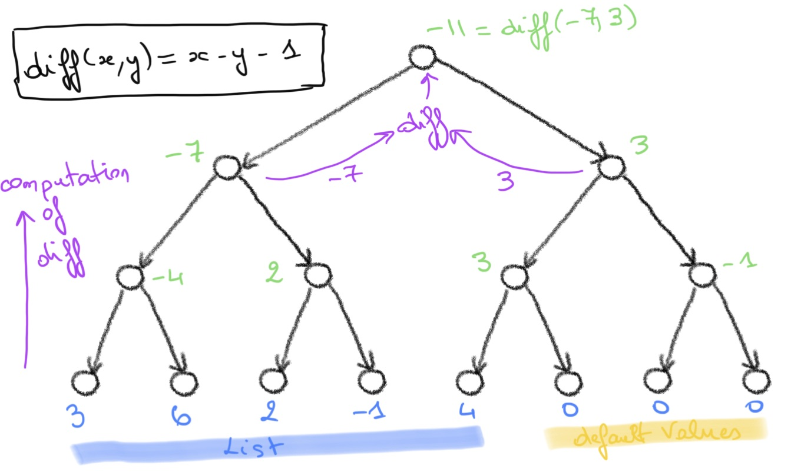
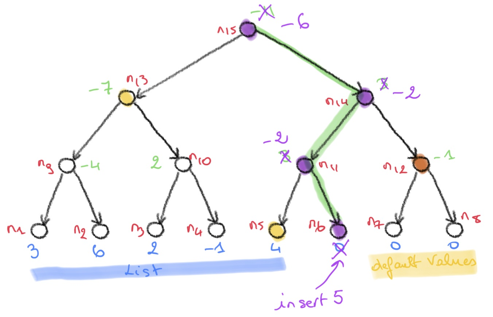
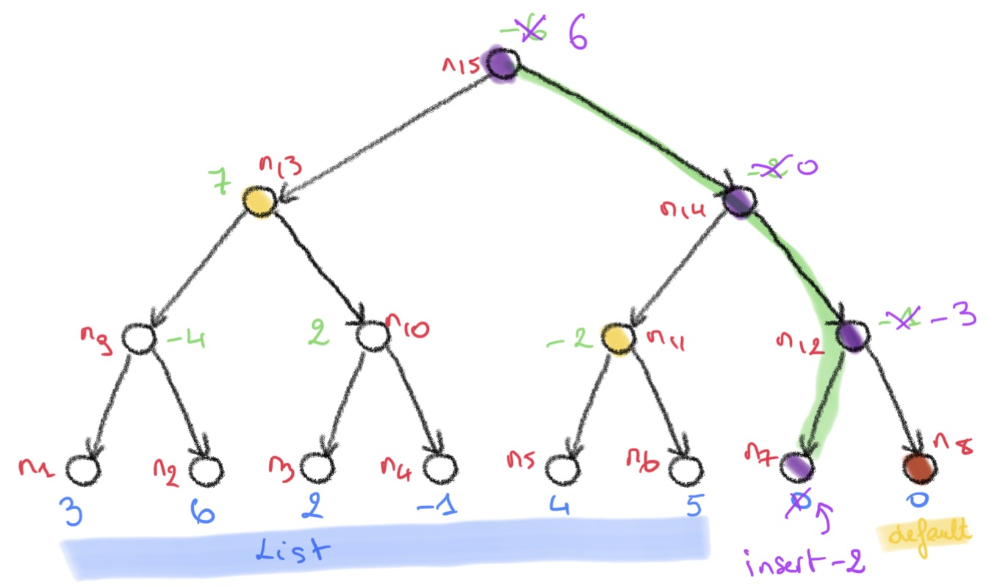

[ [up] ](../README.md) [ [next] ](./stats.md)

# Background

The core component of the Deposit Smart Contract is the so-called _Incremental Merkle Tree_ algorithm.

> A **Merkle tree** is a _binary_ and _complete_ tree decorated with the Merkle (_hash_) attribute.

In this definition, a node's decoration is the _hash_ of the decorations of its children (the decorations
on the leaves are given).
Computing the attribute for all the nodes of a tree usually requires to walk the tree and to explore all the nodes, 
for instance using a Depth First Traversal algorithm.

In the context of a Blockchain, a Merkle tree is used to compute a _property_ of a collection of elements e.g. a list `L`. 
Given `L`, we first build a tree representation `T(L)` for `L`, e.g. the leaves of `T(L)` are the elements of `L`.
The property of the list `L` is the value of the attribute (e.g. _hash_) at the root of `T(L)`.

The value on the tree root can be used to test membership of an element in the list `L`. The is known as a _Merkle Proof_.

> In this project we are not concerned with Merkle Proofs but rather in computing an attribute (e.g. _hash_) on the root of a tree that stores a list `L`.

## Binary and Complete Trees

We assume the reader is familiar with standard tree structures. Given a tree `T`, the _height_ of `T` is the length of the longest path
from the root of `T` of any leaf.

> A tree is:
> 1. a **binary** tree if every node that is not a leaf has at most two children and,
> 2. a **complete** (or perfect) tree if all the branches of the tree from the root to the leaves have the same _height_ `h`.

<figure>

<figcaption><strong>Figure 1</strong>: A complete binary tree of height 3. The tree has 15 nodes and 8 leaves.</figcaption>
</figure>

> As a complete binary tree `T` of height `h` satisfies the following properties:
> 1. the number of nodes in `T` is `2^(h + 1) - 1` and,
> 2. the number of leaves in `T` is `2^h`.

<!-- > It follows that complete binary trees of height `h` can store lists of at most `2^h` elements. -->

## Decorated trees 

The Merkle attribute belongs to the category of _synthesised_ attributes.

> A _synthesised attribute_ on a tree is defined **bottom-up**: the values of the decorations are given on the leaves, and to compute the values on the internal nodes, the values of the left and right children are combined using a binary function.

For the sake of simplicity we assume that the attribute to compute on the tree `T` is a simple function `diff`, 
with `diff(left, right) == left - right - 1`.
Each leaf holds an _integer_ value, and the value of an internal node is the _diff_ function applied to the values 
of the left and right children.

The leaves of `T` contains the elements of a list `L` from left to right when traversed _in-order_ (left, node, right).
To represent a list `L` of `n < 2^h` elements with a binary complete tree of height `h`,
 `L` can be **right-padded** with dummy or neutral elements (e.g. zeroes) to obtain `L'` of length `2^h`. 

For instance, the tree below stores the list `[3, 6, 2, -1, 4]` and the value at the root of the tree is `-11`.

<figure>

<figcaption><strong>Figure 2</strong>: The `diff` attribute computed on a tree. The value of an internal node (including the root)
is computed by combining the values of the left and right children using `diff`. </figcaption>
</figure>

> The _root value_ of `T(L)` is the value of the attribute `diff` at the root of `T(L)`.

# Incremental Computation of Synthesised Attributes on Trees

We assume a fixed given height `h`.
Given a list `L`, we denote `T(L)` the decorated tree of height `h` that contains the list `L`.

The _incremental Merkle tree_ problem is informally stated as:

> Assume we have a collection that _grows monotonically_, e.g. successive lists 
> `L`, `L :: e1`, `L :: e_1 :: e_2`, ... and so on (where _::_ is the `append` operator on lists).
> Can we _incrementally_ (and efficiently) compute the successive properties of `L`, `L :: e1`, `L :: e_1 :: e_2`
> i.e. the values of the root of the trees `T(L)`, `T(L :: e1)`,
> `T(L :: e1 :: e2)`, ... ?

By efficiently, we mean without traversing the `2^h` nodes of the tree.

## Inserting a value in a tree

Let `L = [3, 6, 2, -1, 4]`.
Assume we want to compute the root value of the `diff` attribute for the list 
`L :: 5`.
As depicted on **Figure 3** below, this amounts to inserting the new value `3` at the next available leftmost leaf
of the tree which is `n6`.

<figure>

<figcaption><strong>Figure 3</strong>: Insertion of value at leaf `n6`. The purple nodes' attribute
values  on the green path to leaf `n6` are impacted by the insertion. To compute the new root value, we only the inserted value, and the value of the nodes on the left (yellow) and right (orange) of the green path. </figcaption>
</figure>

The green path above is the path from the root to the leaf where the new value is inserted. 

> Fact 1: the decorations on the trees T(L) and T(L :: 5) differ only on the green path.

> Fact 2: to compute the root value of `T(L :: 3)` we only need the values on the nodes that are _siblings_ of nodes
>   on the green path. As depicted above, if we have the values of `diff` on the left (yellow) 
>   and on the right (purple) nodes, we can compute the root value of `T(L :: 3)`.

> Fact 3: The leaves (`n7`, `n8`) on the right of the green path all have the default value. As a consequence, 
>   the right (purple) nodes have a default value that correspond to their height.  Height `0` is
>    a leaf, and the value is default (e.g. `0` for our `diff` attribute).
>   At height `1`, the value is `diff(0, 0) = -1`, at height `2` it is `diff(diff(0,0), diff(0,0)) = -1` and so on. 

If we want to compute the new root value after inserting `5` at `n6` we just need to walk up
the green path and compute the `diff` attribute. This can be done in time `O(h)` (`h` is the height of the tree).

After inserting `5` at `n6` in the tree we obtain the new tree depicted below in **Figure 4**:

<figure>

<figcaption><strong>Figure 4</strong>: Insertion of another value at leaf `n7`. </figcaption>
</figure>

The green path is also updated to be the path to the next available leaf (`n7`). 

## Incremental Computation of the Diff attribute

The result of the previous facts is that the computation of the new root value can be done using
the values of the left and right siblings of the green path.
They can be stored in two vectors the size of which is the height of the tree.

Now assume that when we insert a new value in the tree, 
we can also compute the new value of those vectors i.e. the values of the siblings on the path to the next
available leaf.

In this case, we can iteratively compute the root value of the tree for a list `e1 :: e2 :: ... :: en`
storing only the two vectors (of size `h`), and computing the new root value by walking up to current path 
in linear time (`O(h)`).

For the reader familiar with algorithm design, it is a typical example of **dynamic programming**.

[ [up] ](../README.md) [ [next] ](./stats.md)
