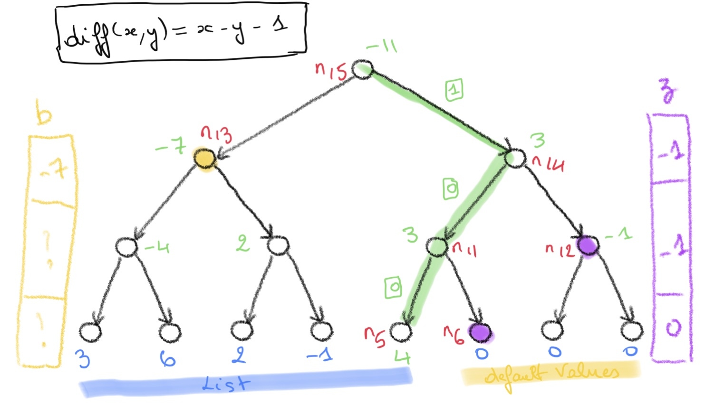
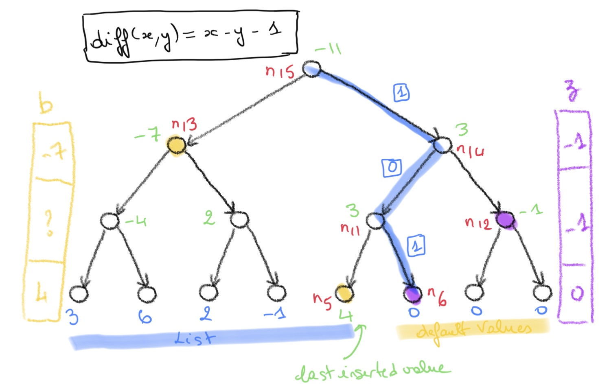

[ [up] ](../README.md) 

# Sketch of the proof

If not familiar with the incremental Merkle tree problem (and algorithms) you may start with the [background section](./background.md) 
for a quick introduction to the problem. 

In this section, without loss of generality,  

> we use a simple attribute `diff` instead of the _hash_ function in Merkle trees.  
> we assume that the trees we mentioned in the sequel are all binary and complete trees.


## Computing the root value of a Merkle tree

<center>
<figure>

<figcaption><strong>Figure 1</strong>: The root value can be computed on the green path using the new inserted value (4), the values on the left siblings of the path (yellow) and right siblings (purple). </figcaption>
</figure>  
</center>

When a new value (e.g. `4`) is inserted in the tree, the root value for the attribute `diff(x, y) = x - y - 1` 
can be computed as follows:

* the **green path** leads to the leaf where the new value `4` is inserted,
* assume we have the **values of the attribute `diff`** on the **left** (yellow) and **right** (purple) **siblings** for each node on the green path.
* we can compute the new root value given by `diff` by **walking up** the green path in the tree.   

If we denote by `n.v` the value of `diff` on a node of the tree, the computation runs as follows walking up each level of the tree:

0. `n5.v = 4` (inserted value) and `n6.v = 0` (default value).
1. `n11.v = diff(n5.v, n6.v) = 3`
2. `n14.v = diff(n.11.v, n12.v) = diff(3, -1) = 3`
3. `n15.v = diff(n13.v, n14.v) = diff(-7, 3) = -11`. 

Assume we have a vector `s` that  stores the values of the siblings at each **level** of the tree.
For instance we can have `s = [-7, -1, 0]` that holds the values of the siblings (`n13`, `n12`, `n6`) of the nodes 
on the green path, from top to bottom.

To decide how to combine the values at each level when walking up the green path, 
we need to know whether we are on a _left_ or _right_ child of a node.
To do so, we can encode the green path as a sequence of _bits_ `0` or `1`. In this example  the green path is encoded
as `[1, 0, 0]` (green boxes in **Figure 1**): from the root node to the leaf, go right (1), and twice left (0). 

Given a list or a sequence `x` of length >= 1, we denote:
* `last(x)` the last element of the list, e.g. `last([1, 0, 2]) = 2`,
* `init(x)` the _initial prefix_ of `x` i.e. the list minus its last element,   e.g. `init([1, 0, 2]) = [1, 0]`.

Given `s`, `p` (the sequence of bits encoding the path from the root to the newly inserted leaf) and the value `seed` inserted at the
leaf (at the end of `p`), we can recursively compute the new root as follows:

```dafny
function computeRootUp(p : seq<bit>, s: seq<int>, seed: int) : int
    requires |p| == |s|
    decreases p
{
    if |p| == 0 then
        //  We are at the root and seed contains the value of the attribute for this node.
        seed 
    else 
        //  Decide how to compute the value at the bottom level (last(p)) 
        //  based on direction of path 0 (left) or 1 (right) at last(p)
        var x := if last(p) == 0 then diff(seed, last(s)) else diff(last(s), seed);
        //  Use x as the new seed on the initial prefix of the path (bubble up)
        computeRootUp(init(p), init(s), x)
}
```
And if we split the siblings's values `s` into two vectors `b` and `z` for the left and right siblings:
```dafny
function computeRootLeftRightUp(p : seq<bit>, b: seq<int>, z: seq<int>, seed: int) : int
    requires |p| == |b| == |z|
    decreases p
{
    if |p| == 0 then
        seed 
    else 
        var x := if last(p) == 0 then diff(seed, last(z)) else diff(last(b), seed);
        computeLeftRightRootUp(init(p), init(b), init(z), x)
}
```
This is it.

The `get_deposit_root()` function in the Deposit Smart Contract makes use of a neat trick: the insertion of a new value in the tree
is handled by a function `deposit()` that makes sure the two vectors `b` and `z` hold the values on the left and right siblings for the path to the leaf that is **next** to the leaf where the last value was inserted (see **Figure 2**).  
<center>
<figure>

<figcaption><strong>Figure 2</strong>: 'b` and `z` hold the values of the left and right siblings for the path to the next
leaf. </figcaption>
</figure>
</center>

As a consequence, the root value can be computed **without the knowledge of the last inserted value** using the default value (0) as the seed.  
The (tail recursive) functional version of the algorithm for computing the root value is:
```dafny
function get_deposit_root(p : seq<bit>, b: seq<int>, z: seq<int>) : int
    requires |p| == |b| == |z|
    decreases p
{
    if |p| == 0 then
        0 
    else 
        var x := if last(p) == 0 then diff(seed, last(z)) else diff(last(b), seed);
        get_deposit_root(init(p), init(b), init(z), x)
}
```

The next section explains how to maintain the values of `b` and `z` to ensure they store the values of
the siblings of the nodes on the path to the next available leaf in the tree (blue path in **Figure 2**).


## Computing the left siblings of the next path

In this section we highlight a surprising result: to update the values of left siblings when a new value is inserted,
we need to perform a single update to the vector `b`.
Indeed, the right siblings are constant (depending on each level) and we do not need to update them.

We will explain how to maintain the values of the left siblings of a path in phases and address the following
issues:

1. given a path to a leaf, what is the **encoding (list of bits) of the next path**, `nextpath(p)` ?
2. if we are **given the values of `diff` on a path `p` and the left siblings `p`**, can we compute 
    the **values of the left siblings on** `nextPath(p)`?
3. if we are **given the value to insert** at the of the current path `p` (and the left siblings of `p`), can we compute
 the **values of the left siblings on** `nextPath(p)`?

The next section address these issues.

### The next path

in this section we address the following problem:
 
> Given a path to a leaf, what is the **encoding (list of bits) of the next path**, `nextpath(p)` ?

The leaves of a complete binary tree of height `h` are indexed from left (index `0`) to right `index power2(h) - 1` (see **Figure 3**). 
Given a path `p` to the `k`-th  with `k < power2(h) - 1` (i.e not the last leaf), 
the _next path_ of `p`  is the path to the `k + 1`-th leaf.

<center>
<figure>

<figcaption><strong>Figure 3</strong>: The next path of a path to <strong>left</strong> leaf. </figcaption>
</figure>
</center>

As mentioned before a path in a complete tree of height `h` can be encoded as a sequence of `h` bits.
**Figure 3** shows a green path `green = [0, 1, 0]` leading to the leaf indexed `3`.
The next path of `green` is `blue == [0, 1, 1]`. 
It is easy to compute the path to the next leaf when a leaf is a left child: we just replace the trailing zero in `p` with
a `1`.

When `p` leads to a right child as `green` in **Figure 4** (below) the next path of `green` is slighly more complicated to compute:
we have to go up the `green` path until we hit a node coming from the left child and then we swap.
In other words, we go up the `green` path and process the bit encoding of `green` form 
last to first to build `nextPath(green)` as follows:
 * if the current bit is a `1` we replace it with `0`,
 * if the current bit is `0` we flip it to a `1`.
 * after flipping to `1` we leave the bits unchanged.  

<center>
<figure>

<figcaption><strong>Figure 4</strong>: The next path of a path to <strong>right</strong> leaf. </figcaption>
</figure>
</center>

As it turns out, we can write the bit encoding of `green` in the form `init :: 0 :: ones(n)` where `ones(n)`, 
`n >= 0` is the list of `n` `1`'s (empty for `n = 0`.)
And `nextpath(green)` is `init :: 1 :: zeroes(n)` where `zeroes` is `n` zeroes.

The generalisation to arbitrary path follows: given `p` of the form `p = init :: 0 :: ones(n)`, `nextPath(p) = init :: 1 :: zeroes(n)`. 
`nextpath(p)` can be broken down into three components as depicted in **Figure 4**: the common  prefix `init` between `p` and 
`nextpath(p)`, the flipped bit, and the _mirrored_ tail of ones.

A few remarks are in order to make sure the previous algorithm is correct:
1. if a path `p` leads to a leaf that is **not the last one**, it **must have a zero** somewhere in its bit encoding.
2. the computation of the encoding of `nextpath(p)`, say `0x.nextpath(p)`, can be obtained by adding `1` in binary to the
encoding of `p`, i.e. `0x.nextpath(p) = 0x.p + 1`.

The following algorithm computes the encoding of the next path of `p`:
```
function nextPath(p : seq<bit>) : seq<bit> 
    /** Path has at least on element. */
    requires |p| >= 1
    /** Not the path 1+ that has no successors. */
    requires exists i :: 0 <= i < |p| && p[i] == 0
    ensures |nextPath(p)| == |p|

    decreases p
{
    if last(p) == 0 then 
        init(p) + [1]
    else 
        nextPath(init(p)) + [0]
}
```

The Dafny source code for operations on path as sequences of bits is [SeqOfBits.dfy](https://github.com/PegaSysEng/deposit-sc-dafny/blob/master/src/dafny/smart/seqofbits/SeqOfBits.dfy).
Note that we do not need to compute or execute the `nextPath` function so we do not need to make it tail recursive.

### Computing the values of the siblings on the next path 

In this section we address the following problem:

> If we are **given the values of `diff` on a path `p` and on the left siblings of `p`**, can we compute 
>    the **values of the left siblings on** `nextPath(p)`?


